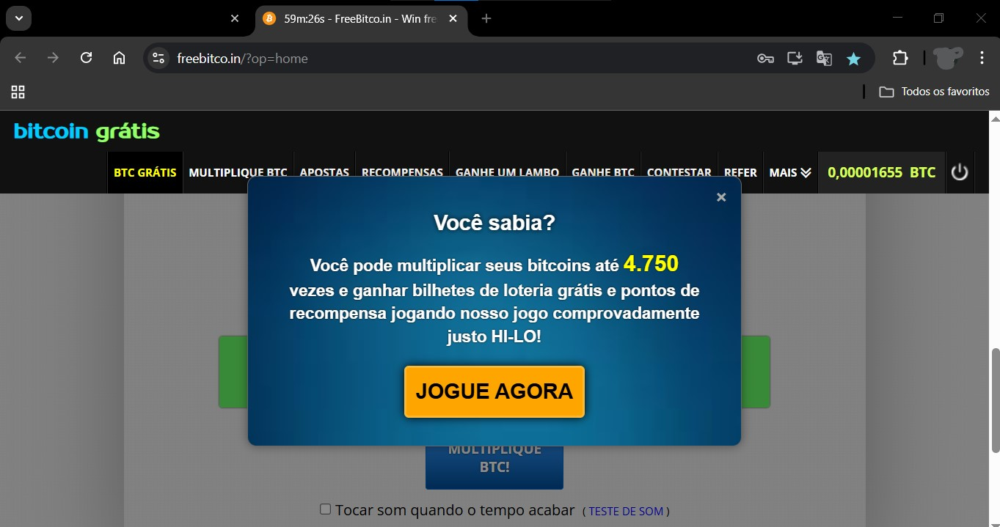
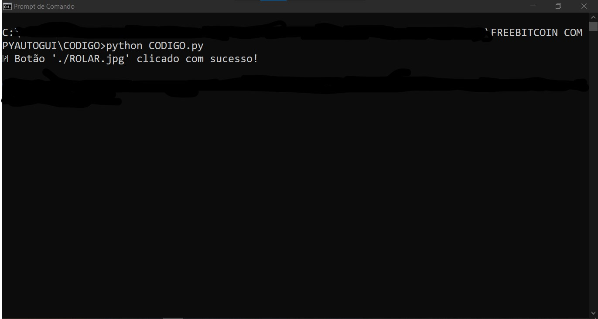

# FREEBITCOIN COM PYAUTOGUI
🤤ESSE PROJETO PODE SER ÚTIL PARA AUTOMATIZAR TAREFAS REPETITIVAS EM SITES COM AÇÕES DE CLIQUE, COMO NO CASO DE GANHAR BITCOINS GRATUITAMENTE EM FREEBITCOIN.

 <br>
 <br>

## DESCRIÇÃO:
Este projeto utiliza a biblioteca **PyAutoGUI** para automatizar o processo de clicar no botão "ROLAR" ou "ROLL" no site [FreeBitco.in](https://freebitco.in/?op=home). Dependendo do idioma em que o site carregar (português ou inglês), o script tentará identificar qual botão está disponível e clicar nele automaticamente. O objetivo é simplificar o processo de interação com o site para atividades repetitivas, como a rotação de uma roleta.

## FUNCIONALIDADES:
- **Abertura automática do navegador e navegação até o site FreeBitco.in.**
- **Rola até o final da página para garantir que o botão "ROLAR" ou "ROLL" seja visível.**
- **Identifica e clica automaticamente no botão "ROLAR" (PT-BR) ou "ROLL" (EN) com base na imagem.**
- **Tratamento de exceções, garantindo que o script continue funcionando, mesmo que o botão não seja encontrado imediatamente.**

## COMO O CÓDIGO FUNCIONA?
1. **Abertura do site:** O script abre o navegador (Google Chrome) e acessa a página do FreeBitco.in.
2. **Rolar a página:** O script rola a página até o final para garantir que o botão de rotação esteja visível.
3. **Detecção de imagem:** O script tenta localizar e clicar na imagem do botão "ROLAR.jpg" ou "ROLL.jpg". Se não encontrar, tenta novamente até localizar.
4. **Clique no botão:** Após encontrar o botão, ele realiza o clique e exibe uma mensagem de sucesso no terminal.

## BENEFÍCIOS:
- **Automação:** Evita a necessidade de clicar manualmente no botão várias vezes.
- **Facilidade de uso:** Basta executar o script para interagir com o site sem precisar se preocupar com o idioma ou com o botão em questão.
- **Eficiente:** O script tentará novamente caso o botão não seja encontrado, garantindo que o processo seja realizado sem interrupções.

## EXECUTANDO O PROJETO:
1. **Instalando as dependências:**
   - Antes de executar o script, certifique-se de instalar todas as dependências necessárias. No terminal, execute o seguinte comando para instalar as dependências listadas no arquivo `requirements.txt` em `CODIGO`:
   ```bash
   pip install -r requirements.txt
   ```

2. **Configuração do navegador:**
   O script foi configurado para abrir o **Google Chrome**, mas você pode ajustar o caminho para o seu navegador preferido (se estiver usando outro navegador como Microsoft Edge, Firefox, etc.):
   ```python
   caminho_chrome = r"C:\Program Files\Google\Chrome\Application\chrome.exe"
   ```

3. **Execute o script:**
   Após configurar, basta executar o script Python:
   ```bash
   python CODIGO.py
   ```

4. **Aguarde o script funcionar:**
   O script irá abrir o navegador, navegar até o site [FreeBitco.in](https://freebitco.in/?op=home), rolar a página até o final, e então buscar o botão apropriado para clicar. O script fará isso de forma repetitiva até encontrar um dos botões.

## NÃO SABE?
- Entendemos que para manipular arquivos em muitas linguagens e tecnologias relacionadas, é necessário possuir conhecimento nessas áreas. Para auxiliar nesse aprendizado, oferecemos alguns subsidios:
* [CURSO DE PYAUTOGUI](https://github.com/VILHALVA/CURSO-DE-PYAUTOGUI)
* [CURSO DE PYTHON](https://github.com/VILHALVA/CURSO-DE-PYTHON)
* [CURSO DE AUTOMACAO](https://github.com/VILHALVA/CURSO-DE-AUTOMACAO)
* [CONFIRA MAIS CURSOS](https://github.com/VILHALVA?tab=repositories&q=+topic:CURSO)

## CREDITOS:
- [PROJETO CRIADO PELO VILHALVA](https://github.com/VILHALVA)
